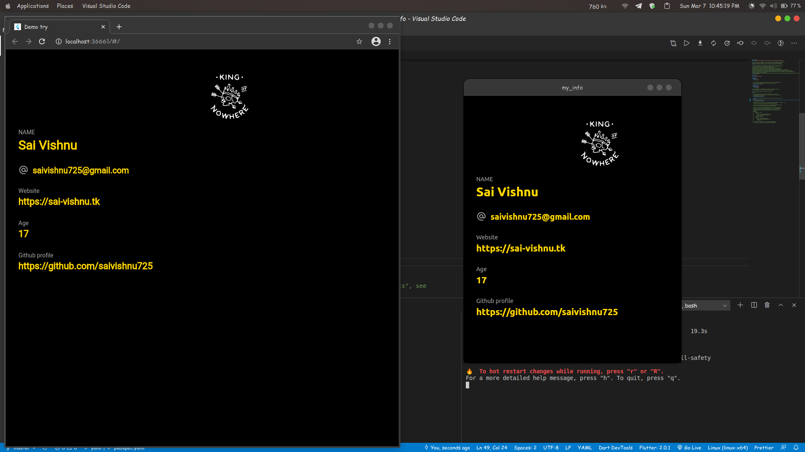

# my_info

A sample project to test Flutter's cross-platform functionality

## Update
Due to recent null-safety and various other security changes in Dart, this project won't be able to compile until necessary changes are performed (and I am in no mood to do it anytime soon)

## License

[GNU General Public License v2.0](https://choosealicense.com/licenses/gpl-2.0/)
